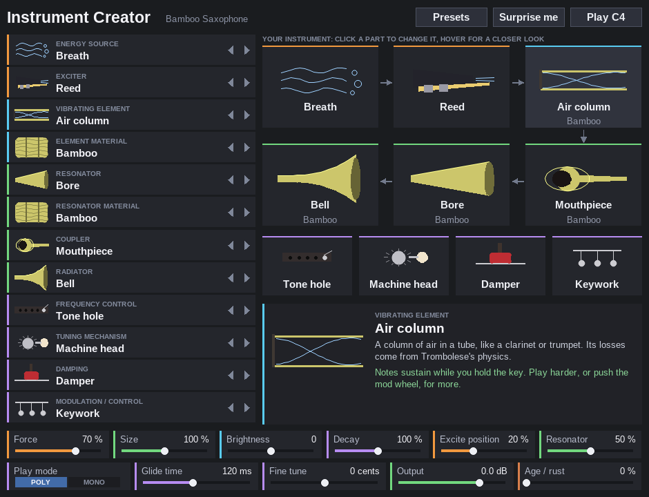

# Instrument Creator

Build instruments that don't exist, from parts, and play them from a MIDI
keyboard in REAPER. A glass trumpet. A violin made of ice. A marimba of marble
bars, a tuba of rubber, a jelly gong.

Every instrument is described the same way real instruments are:

> **energy source → exciter → vibrating element → coupler → resonator → radiator**,
> plus four **controls**: frequency control, tuning, damping and modulation.

Pick one option for each part, pick what the element and the resonator are
made of, and play. The plugin works out how the whole thing sounds from the
physics of the parts, the same way Trombolese does for its bore and
Reverberator does for its materials.

It is a single-file **JSFX** instrument for REAPER: `Instrument-Creator.jsfx`.
No compiling, no installer.



## Installing in REAPER

1. Download `Instrument-Creator.jsfx` from this repository.
2. In REAPER choose **Options → Show REAPER resource path in explorer/finder**.
3. Open the **Effects** folder there and put `Instrument-Creator.jsfx` in it (a
   subfolder is fine).
4. In the FX browser press **F5** to refresh (or restart REAPER), then search
   for **Instrument Creator**. It shows up as *JS: Instrument Creator - build
   impossible instruments from parts*.
5. Put it on a track, arm the track for recording with your MIDI keyboard as
   the input (and record monitoring on), and play. Or draw MIDI notes on the
   track.

It is an instrument, so it goes first in the FX chain and makes its own sound.
Reverberator makes a very good partner after it.

## Using the window

- **The list on the left** has your twelve choices: the ten parts, plus what
  the vibrating element and the resonator are made of. Click a row for a menu,
  click the small arrows to step through the options, or roll the mouse wheel
  over it.
- **The picture on the right** is your instrument, drawn part by part, in the
  order the energy flows through it. Click any part in it to change it. The
  element's picture moves when it sounds.
- **Hover over anything** and the panel at the bottom shows a big picture of
  that part, what it does, and (for materials) how stiff and heavy it is and
  how long it rings. The green line tells you how your combination will play,
  and the little screen shows the sound's waveform as you play.
- **Presets** has 19 ready-made instruments to start from. **Surprise me**
  picks every part at random. **Play C4** plays a note so you can hear a change
  without touching your keyboard.

You don't need to supply any pictures: every part and material is drawn by
the plugin itself.

## The parts

### Energy source: where the power comes from

| Option | What it does |
|---|---|
| **Breath** | A steady stream of air. Notes last as long as you hold the key. |
| **Bow** | A bow drawn at steady speed. Sustains, with a little rosin grit. |
| **Finger** | One soft push. Each note is played once, gently. |
| **Plectrum** | One sharp flick. Bright and quick. |
| **Hammer** | One hard blow. Very sensitive to how hard you play. |
| **Electricity** | A steady, perfectly smooth drive. Sustains forever. |

A *steady* source (breath, bow, electricity) with a *striking* exciter keeps
striking while you hold the key: a drum roll, a mandolin tremolo, a buzzer.
A *single push* (finger, plectrum, hammer) into a *sustaining* exciter (reed,
lips, bow) makes each note swell and then fade, like squeezing a bulb.

### Exciter: what actually touches the vibrating part

| Option | What it does | Sustains? |
|---|---|---|
| **Reed** | A cane reed chopping the airflow into pulses (clarinet) | yes |
| **Lips** | Buzzing lips, a valve that blows open (trumpet), Trombolese's lip model | yes |
| **Hammer** | A hard, short strike (piano) | no |
| **Bow** | Stick-slip friction (violin) | yes |
| **Plectrum** | Pulls it aside and lets go (guitar) | no |
| **Mallet** | A soft, padded strike (marimba) | no |

### Vibrating element: the part whose vibration sets the pitch

| Option | What it sounds like |
|---|---|
| **String** | A stretched string. Stiff materials have to be thick rods, so a marble or glass "string" rings like a bell. |
| **Membrane** | A drum skin: inharmonic, rings near the edge, thuds in the middle. |
| **Bar** | A xylophone-style bar: overtones at 2.76 and 5.40 times the note. |
| **Plate** | A flat sheet, like a gong or bell plate: dense and shimmering. |
| **Reed** | A clamped tongue or tine, like a kalimba or harmonica. Blown, it buzzes. |
| **Air column** | Air in a tube, like a clarinet, trumpet or flute. |

### Materials: for the element, and for the resonator

31 materials. Each is described by its real stiffness, density and internal
loss, which decide how long it rings and how bright it stays.

| Family | Materials |
|---|---|
| Metals | Steel, Brass, Bronze, Aluminium, Gold, Tin (galvanised roof sheet), Car panel (painted steel), Chain link (steel wire mesh), Handpan steel, Foil (crumpled aluminium) |
| Glass and stone | Glass, Crystal, Ice, Marble, Clay |
| Woods | Wood (plain hardwood), Spruce, Rosewood, Bamboo |
| Plastics | Plastic, PVC, Nylon, Carbon fibre, Cling film |
| Soft and natural | Bone, Gut, Leather, Rubber, Paper, Cardboard, Jelly |

Ice, marble, clay, wood, bone, foil, tin and chain link are irregular
inside (bubbles, cracks, grain, creases, ribs), which splits each resonance
into a slowly beating pair. Some materials also misbehave the way the real
things do when you play them hard: **tin and chain link rattle**, a **car
panel clanks**, **cling film slaps and buzzes** like a kazoo, and **foil
crackles**. Play softly and they stay clean. Rubber, paper, cardboard,
leather and jelly are very soft and lossy: they thud, and jelly wobbles in
pitch.

**Every Reverberator option is here.** Reverberator's options are objects;
these are the materials they are made of:

| Reverberator | Instrument Creator material |
|---|---|
| Chain link fence | Chain link |
| Ice sheet | Ice |
| Tension wire, piano string, guitar string, metal barrel | Steel |
| Gong | Bronze |
| PVC pipe | PVC |
| Glass, wine bottle | Glass |
| Marble | Marble |
| Car body panel | Car panel |
| Leather | Leather |
| Violin string | Gut (or Steel) |
| Steel handpan | Handpan steel |
| Toilet roll tube | Cardboard |
| Aluminium foil | Foil |
| Cling film | Cling film |
| Corrugated tin roof | Tin |

To make, say, a PVC flute, choose **Air column** with **PVC** as the element
material (and PVC for the resonator too, if you like).

### Resonator: what the vibration fills

| Option | What it does |
|---|---|
| **Bore** | A cone-shaped tube tuned to each note: reinforces every harmonic (saxophone). |
| **Soundbox** | A hollow body with a guitar's resonances, moved by its material and the Size control. |
| **Pipe** | A stopped tube under each note, like a marimba's: reinforces the odd harmonics. |
| **Cavity** | A pocket of air (gourd, bottle): a hollow boom, with the walls ringing. |
| **Body** | A solid block of the material, which adds its own ring. |

### Coupler: how the vibration gets from the element to the resonator

| Option | What it does |
|---|---|
| **Bridge** | The bright "bridge hill" of a violin or guitar, around 2.5 kHz. |
| **Soundpost** | Strong coupling into the body: warm and woody, with a shorter ring. |
| **Mouthpiece** | A small cup: a vocal, brassy formant. |
| **Windway** | A narrow air duct (recorder): breathy. It turns lips or a bow into a flute's air jet. |

### Radiator: how it gets into the air

| Option | What it does |
|---|---|
| **Bell** | Throws the highs forward, and gets brassy when played loud. |
| **Soundboard** | A wide board that spreads and softens the sound. |
| **Drumhead** | A skin that rings along, like a banjo head: twangy, with a low boom. |
| **Cone** | A loudspeaker: electric-instrument tone with a little amplifier grit. |

### The controls: how it is played

| Part | Option | What it does |
|---|---|---|
| **Frequency control** | Fret | Fixed semitone stops; in Mono mode new notes hammer on. |
| | Tone hole | Harmonics above about 1.5 kHz leak out (woodwind); in Mono mode, a key blip between notes. |
| | Valve | A few notes are slightly sharp, as on a real trumpet; in Mono mode, a valve blip between notes. |
| | Slide | Every note glides from the last one (trombone). Pitch bend covers 7 semitones. |
| | Key | Every note is independent (piano). |
| **Tuning mechanism** | Peg | Never quite in tune, drifting a little. |
| | Tuning pin | Piano-style stretched octaves. |
| | Machine head | Exact equal temperament. |
| | Slide | Each note starts a little flat and settles into tune. |
| **Damping** | Damper | Stops the note when you let go (sustain pedal lifts it). |
| | Mute | Darker and more nasal. |
| | Palm | Short, chunky notes. |
| | Felt | Soft, dark, intimate; strikes are softer too. |
| | Hand | Darker and slightly flat, like a hand in a horn's bell. |
| **Modulation / control** | Keywork | Mod wheel blows or bows harder. |
| | Pedals | Sustain (CC64) and soft (CC67) pedals; mod wheel lifts the dampers. |
| | Valves | Mod wheel half-presses a valve: pitch sags, tone gets stuffy. |
| | Levers | Mod wheel bends notes up by as much as a whole tone. |
| | Electronics | Mod wheel adds vibrato and tremolo. |

## The sliders

| Slider | What it does |
|---|---|
| **Force / pressure** | How hard it is blown, bowed or struck. |
| **Size** | Scales the resonator, coupler and radiator: bigger is lower and boomier. |
| **Brightness** | Lets the high frequencies ring longer (+) or die faster (−). |
| **Decay** | Longer or shorter ring, without changing anything else. |
| **Excite position** | Where the exciter touches: near the end (thin, bright) or towards the middle (full, round). |
| **Resonator amount** | How much of the resonator you hear against the bare element. |
| **Play mode** | Poly, or Mono (legato): one note at a time, so frets, tone holes, valves and slides change pitch the way they do on the real thing. |
| **Glide time** | How long a Slide takes to reach the next note. |
| **Fine tune** | ± 100 cents. |
| **Output** | Overall level. |
| **Age / rust** | How old and neglected the instrument is, from new (0 %) to found in a skip (100 %). See below. |

### Age / rust

Turn it up and the whole instrument wears out, whatever it is made of:

- **it rings for less time and sounds duller**: rust, cracks and tired joints
  add internal loss, most of all to the high frequencies, and the resonator
  goes dead too. At 100 % a marble marimba note fades in less than half the
  time;
- **it goes uneven**: rust patches and cracks split every resonance into a
  slowly beating pair, even in materials that were clean;
- **it goes out of tune**: every note is off by its own amount (up to about
  a quarter of a semitone) and wanders slowly;
- **things come loose**: everything starts to rattle when played hard, and
  gets a little rusty grit;
- **it leaks**: blown and bowed instruments get wheezy and breathy, and old
  tubes are rougher inside.

The pictures rust and get grimy to match (metals rust most). Struck,
plucked and bowed instruments get a little volume back as they age, so an
old one is only a few dB quieter than a new one. Presets don't change the
Age slider, so you can make any preset old. Changes to Age apply to the next
note you play; the tuning wander and the leaks act on notes already playing.

The part choices are also sliders, hidden from the slider list because the
window shows them, but you can still automate them in REAPER.

## MIDI

Velocity, pitch bend, mod wheel (CC1), breath controller (CC2), expression
(CC11), channel pressure (aftertouch), sustain pedal (CC64) and soft pedal
(CC67) all do something. Up to 8 notes sound at once.

## Presets

| Preset | Recipe |
|---|---|
| Bamboo Saxophone | breath, reed, bamboo air column, bore, mouthpiece, bell |
| Ice Violin | bow on an ice string, ice soundbox, bridge, soundboard |
| Marble Marimba | mallet on marble bars over marble pipes |
| Glass Trumpet | lips on a glass air column, mouthpiece, bell, valves |
| Crystal Music Box | plucked crystal tines on a crystal block |
| Rubber Tuba | lips on a big rubber bore |
| Electric Bone Harp | plucked bone strings in a bone cavity, through a speaker cone |
| Clay Drum | mallet on a clay membrane over a clay cavity, palm-damped |
| Jelly Gong | a rolled jelly plate |
| Steel Flute | an air jet across a steel air column (windway) |
| Bowed Ice Bar | a bowed ice bar over an ice pipe |
| Golden Piano | hammered gold strings in a spruce soundbox |
| Paper Accordion | breath through paper reeds |
| Carbon Trombone | lips, carbon-fibre bore, slide, mono |
| Buzzing Glockenspiel | an electric buzzer hammering aluminium bars |
| Bronze Bell Plate | a hammered bronze plate |
| Plastic Recorder | an air jet in a plastic tube over a plastic pipe |
| Cling Film Kazoo | lips buzzing a cling-film membrane over a cardboard cavity |
| Tin Roof Banjo | plucked steel strings, a tin cavity and a drumhead |

## Tips

- Sustaining instruments (reed, lips, bow, jet) respond to how hard you play,
  to the mod wheel with *Keywork*, and to a breath controller if you have one.
- For a real legato wind or brass line, set **Play mode** to *Mono*.
- Very lossy materials (rubber, paper, cardboard, leather, jelly) are quiet and short when struck.
  That's what they are like; give them a steady energy source, or turn Decay up.
- Changing a part changes the next note you play. Notes already sounding
  finish as they started.

## How it works, briefly

- **Strings and air columns** are *waveguides*: a delay loop the length of one
  round trip, with the material's losses and stiffness built into the loop,
  tuned so each note lands exactly on pitch (Reverberator's method). Air
  columns lose energy the way Trombolese's bore does, to the thin layer of air
  rubbing on the wall, and at the open end.
- **Membranes, bars, plates and tines** are *modal*: a bank of resonances at
  the shape's textbook frequencies, each decaying at the rate the material's
  loss factor gives it. When a bow, reed or lips drive one, each resonance
  becomes its own small loop ("banded waveguides"), so the exciter can grip it.
- **Exciters** are the standard physical models: a clarinet reed, Trombolese's
  lip valve (a mass on a spring that blows open, with the airflow through it
  solved exactly), a bow's stick-slip friction, a flute's air jet, and shaped
  strikes whose hardness depends on how hard you play and on the material.
- **Couplers, resonators and radiators** shape and spread the sound after the
  element: tuned tubes for bore and pipe, measured body resonances for the
  soundbox, a Helmholtz resonator for the cavity, the material's own plate
  modes for a solid body.
- All combinations are level-matched, so switching parts doesn't jump in
  volume.

Further reading:

- [`docs/PARTS-AND-MATERIALS.md`](docs/PARTS-AND-MATERIALS.md): the
  technical reference: every part and material, with the equations, the
  constants and the measurements behind them.
- [`docs/adr/`](docs/adr/README.md): the big design decisions and why they
  were made.
- [`docs/SESSION-LOG.md`](docs/SESSION-LOG.md): how it was built and
  measured, including what went wrong, and what is still open.

## Relation to Trombolese and Reverberator

- From **Trombolese**: the lip valve (outward-striking, Bernoulli flow solved
  exactly against the bore), the air column's boundary-layer loss and its
  0.6133 × radius end correction, the lesson that a physical model is only
  right once it is measured, and the practice of measuring the exciter's pull
  on the pitch and taking it out.
- From **Reverberator**: the material table idea (every material as real
  constants), loss factor → decay time, stiff-string inharmonicity,
  phase-exact loop tuning, the dispersion budget, loss filters fitted so the
  loop can never gain energy, and the headless test rig.

## For developers

`tools/` holds a headless test rig built on
[ysfx](https://github.com/JoepVanlier/ysfx), which runs JSFX with the same
EEL2 engine as REAPER, including the graphics:

```bash
tools/build_host.sh                      # builds tools/build/render, shot, inspect (~1 min)
python3 tools/sweep.py 60                # every energy x exciter x element: level, pitch
python3 tools/range.py 1=0 2=0 3=5       # one combination across the keyboard
python3 tools/check.py                   # stability sweep, must report 0 failures (~10 min)
python3 tools/trims.py                   # loudness trims after a sound change
python3 tools/shot.py out.png            # screenshot of the window
python3 tools/spectrograms.py out.png    # spectrograms of every preset
```

The Python tools need `numpy`, `scipy` and `matplotlib`. See `CLAUDE.md` for
the traps.

## Licence

GPL-3.0, see `LICENSE`.
